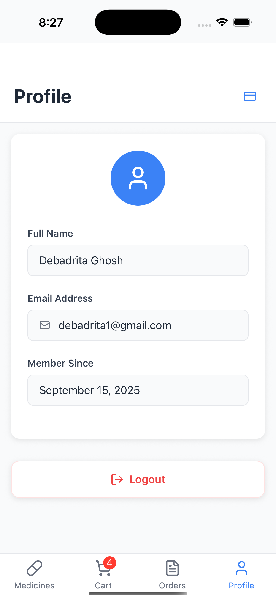

# Medicine Ordering App (MVP)

This is a simple yet fully functional **Medicine Ordering App** built with **React Native**. The app allows users to browse medicines, add them to their cart, checkout, and view their order history. It provides essential features like user authentication, a medicine list with search & filter, a cart system, and order tracking—all stored locally.

### 📝 **Note**:

This **app was created as part of an assignment** to demonstrate my skills in **React Native** development. It's a Minimum Viable Product (MVP) and is intended to showcase core functionalities like authentication, cart management, and order history. The project doesn't involve backend integration as the user data and order information are stored locally using **AsyncStorage** or **SQLite**.

## 📲 Features

1. **Authentication**

   * User can **Sign Up** and **Login**.
   * Basic validation for email format and password (min. 6 chars).
   * User info is stored locally (using AsyncStorage).

2. **Medicine List**

   * Display medicine details like **name**, **price**, and **image**.
   * Users can **search** and **filter** medicines by category.

3. **Cart & Checkout**

   * Users can **add** or **remove** items from the cart.
   * Shows **total price** of items in the cart.
   * On checkout, the order is saved to local storage and the cart is cleared.

4. **Order History**

   * Users can view their **previous orders** with details such as items, total amount, and date.

5. **Responsive UI**

   * Clean and responsive design with **Expo Navigation** (Tab + Stack navigation).
   * Supports **FlatList** for rendering large lists of medicines.

## ⚙️ Technical Features

* **React Native Expo**.
* Functional components using **React Hooks**.
* **State Management**: Context API .
* **Persistence**: User data and orders are stored locally using **AsyncStorage**.
* **Responsive UI** using **Expo Navigation**.

### Libraries Used

* AsyncStorage (for persistence)
* lucide-react-native (for icons)

## 🚀 How to Run the App

### Prerequisites

1. Ensure you have **Node.js** installed (v20.19+).
2. Make sure you have **Android Studio** or **Xcode** for device emulation.

### Installation

1. Clone the repository:

   ```bash
   git clone https://github.com/DebadritaGhosh/MedicineMVP.git
   cd MedicineMVP
   ```

2. Install dependencies:

   ```bash
   npm install
   ```

3. Run the app:

   * **For iOS**:

     ```bash
     npx expo start --ios
     ```
   * **For Android**:

     ```bash
     npx expo start --ios
     ```

4. Open the app on your emulator or device!

## 🖼️ App Screenshots

Here are some screenshots of the app in action:

* **Sign In Screen**
  

* **Sign Up Screen**
  

* **Cart Screen**
  

* **Profile Screen**
  

* **Order History Screen**
  

* **Home Screen (Medicine List)**
  

## 🔧 Setup and Customization

If you want to set up the project locally or make changes, you can follow these steps:

1. Fork or clone the repository.
2. Install dependencies using `npm install`.
3. Run the app with `npx expo start`.
4. Customize or extend features as needed!

## 📖 Documentation

* **Login/Signup**: Handles user authentication.
* **Medicine List**: Displays all available medicines with search & filter functionality.
* **Cart**: Manage medicines in the shopping cart.
* **Order History**: View past orders and their details.
* **Profile**: Basic user information.

## 💡 Bonus Features (Optional)

* TypeScript support for better type safety.

## 🛠️ Libraries Used

* `lucide-react-native` for icons.
* `@react-native-async-storage/async-storage` for data persistence.

## 📅 Timeline

* Completed the MVP in **48 hours** as per the assignment requirements.

---

### Notes:

* If you encounter any issues while running the app, feel free to open an issue in the GitHub repo.
* If you're interested in contributing or have any suggestions, don't hesitate to reach out!